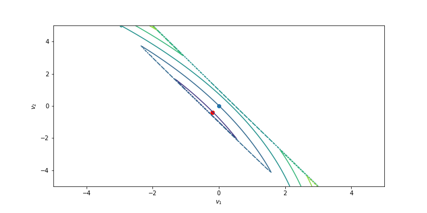

# LASSO

This work, done for the MVA master in 2019, gathers some considerations on the LASSO (Least Absolute Shrinkage Operator and Selection Operator) problem. This problem is viewed as a convex optimization problem and is solved by deriving and studying duals thanks to the barrier method. 

There is a unique python file for this repository, all the explanations on how to use it are in the PDF report. 

Enjoy!

